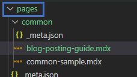
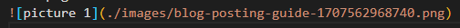
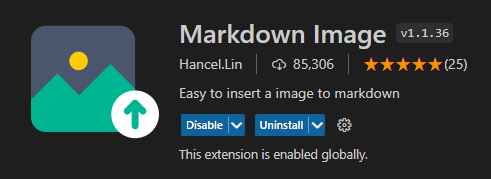
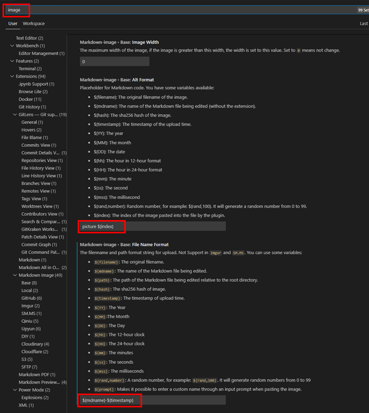
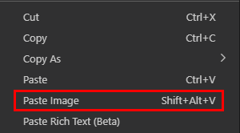
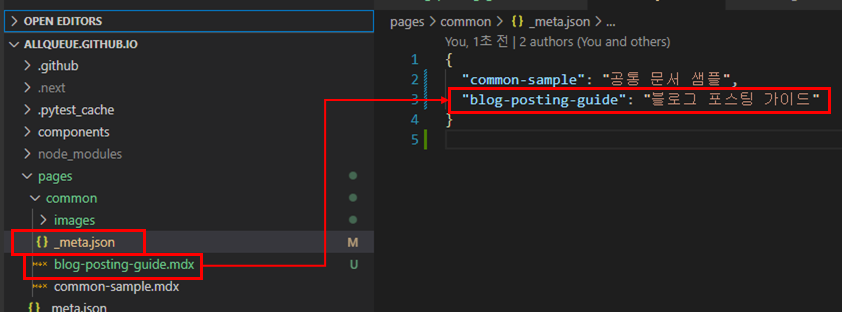
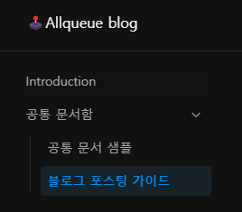
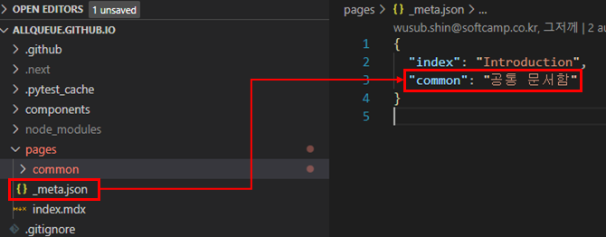
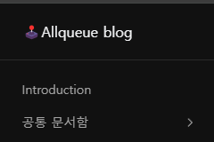

# 포스팅 생성

## 포스팅을 위한 MDX 생성

1. **pages** 하위에 **.mdx** 문서 생성
  

2. 문서의 네이밍 규칙 **`(영문, 소문자, -)`**

---

## 내용에 이미지 추가

1. 문서가 위치하는 디렉토리의 ** `./images/<문서 이름>-<랜덤id>` ** 경로에 이미지 생성
  

### VSCODE 에서 MD 이미지 추가 팁

1. Markdown Image 라는 extension 추가
  

2. Markdown Image extension 설정을 아래와 같이 진행

- **Markdown-image > Base: Alt Format : `picture ${index}`**
- **Markdown-image > Base: File Name Format : `${mdname}-${timestamp}`**
  

3. 마우스 우클릭 **Paste Image** 또는 단축키 (윈도우 : alt + shift + v, MAC : 모름ㅠ)

  

---

## Display Title 커스텀 지정 (한글 제목 노출)

1. 포스팅이 존재하는 디렉토리의 `_meta.json`에 `{ <mdx 파일 이름> : < 노출될 타이틀 명 > }` 형식의 내용 추가

### 결과 

  

---

## 카테고리 항목 추가 (디렉토리 추가)

1. `pages` 디렉토리 하위에 신규 카테고리(디렉토리) 생성
2. 가장 루트 경로의 `/pages/_meta.json` 을 열람하여  `{ < 디렉토리 이름 > : < 노출될 카테고리 명 > }` 형식의 내용 추가

  

### 결과 

  
