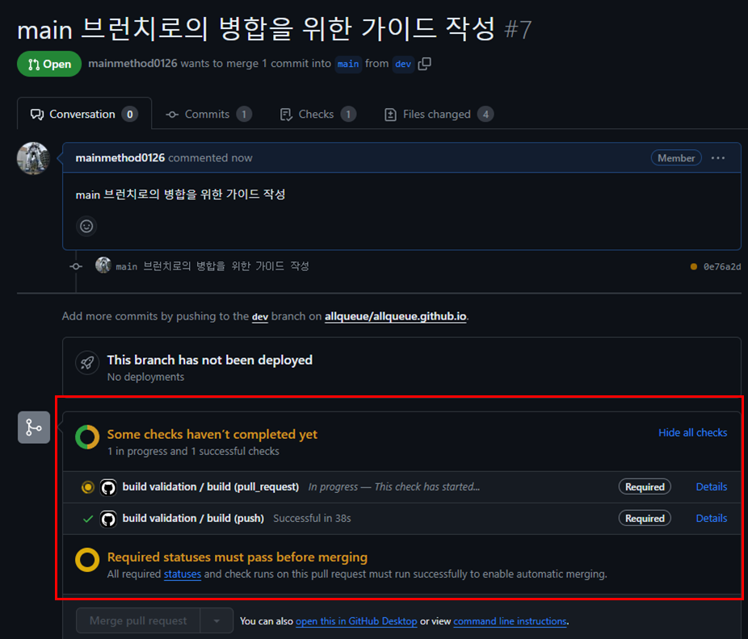
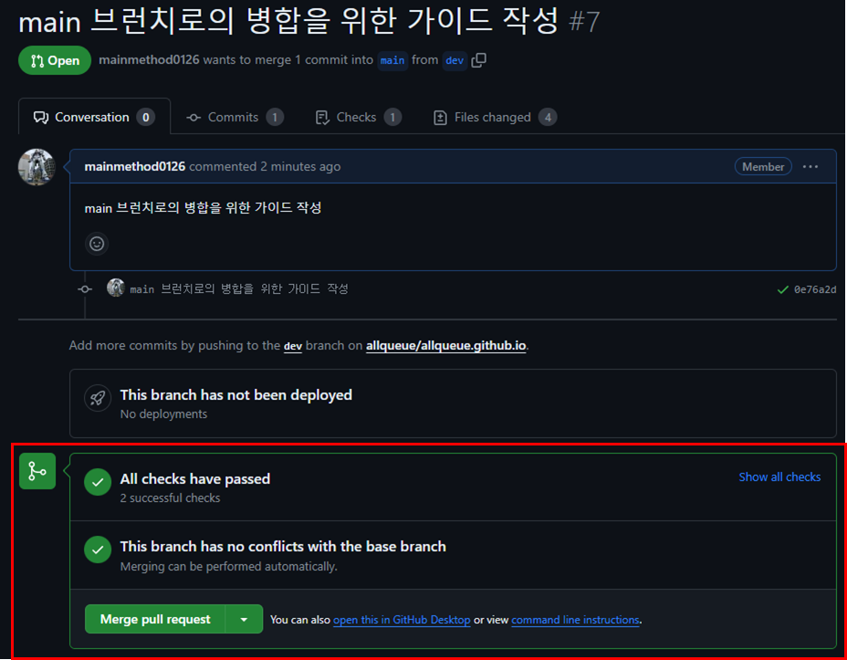

# 작성된 포스트 main 브랜치로의 병합 가이드

## 포스트에 대한 신규 브랜치 생성

명명 규칙 (권고)

깃허브 이슈로 등록 되어있을 경우 : `<github repository issue 번호>/<목적>`
```text filename="exist github issue"
16/edited-my-profile
```

issue 등록이 안되어있을 경우 : `<목적>`
```text filename="not exist github issue"
edited-my-profile
```


## 브랜치 변경

신규 생성된 브랜치로 체크아웃

## 포스팅 작성

1. [포스팅 생성](https://allqueue.github.io/common/blog-posting-guide/create-post) 를 참고해서 포스팅을 작성

## Remote 로 Push

1. `https://github.com/allqueue/allqueue.github.io` 의 신규 브랜치로 push

## main 브랜치로 PR 요청

1. `build validation workflows` 가 완료된 후 결과가 `성공` 이면 main 브랜치로 pull reuqest 요청 (현재는 리뷰어 불필요)
2. `github Actions` 에서 `build validation workflows` 가 PR 요청을 트리깅하여 **자동으로 빌드 검증** 실행

`빌드 검증` 예시


3. 성공하면, 병합 진행

성공 후 `병합이 활성화된 화면` 예시
  


