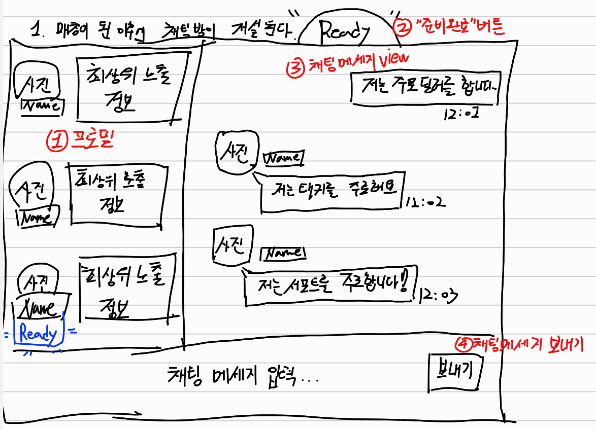
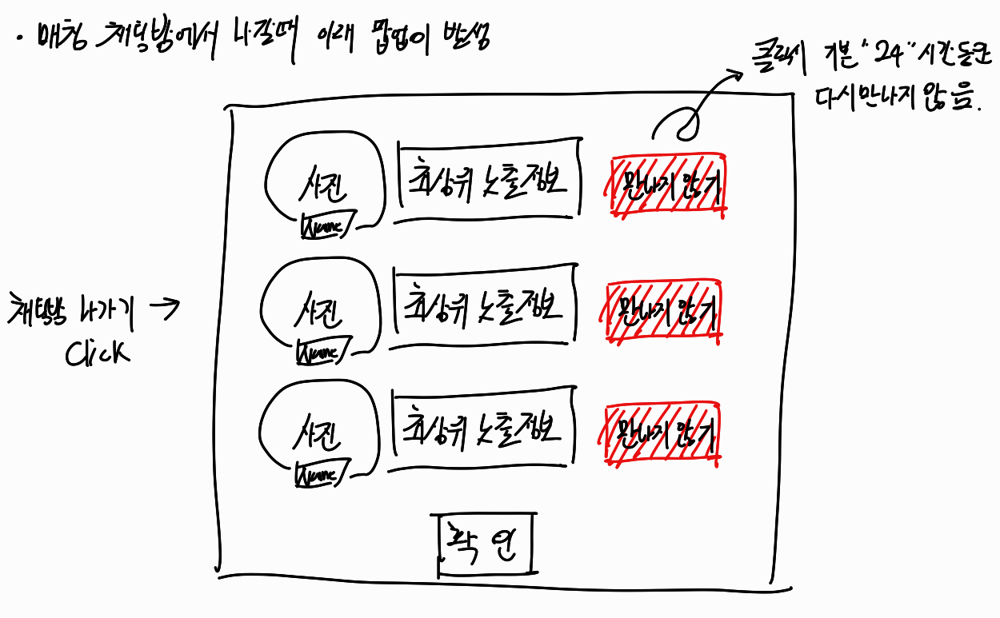

# 매칭 채팅방 기획 초안

  

## 1. 프로필

- 매칭된 인원의 프로필을 확인할 수 있습니다.
- `Name` 는 `Allqueue` 서비스에서 사용되는 `닉네임`입니다.
- 마우스를 오버랩하면 현재 매칭된 게임에 대한 사용자 `상세 프로필`이 보입니다.
- `최상위 노출정보` 는 해당 게임에서 가장 팀원을 선별하기에 `핵심`이 되는 사용자 정보입니다. (예 : 오버워치, 롤 같은 랭크 게임에서는 `경쟁전 티어`, 성장형 RPG 게임에서는 `레벨` 등이 해당할 수 있습니다)
- 마우스로 `사진` 부분을 클릭하면 `프로필 상세 모달`이 노출됩니다.
- 상세 프로필에는 사용자의 게임 ID 등의 중요한 정보들이 노출됩니다.

## 2. Ready 버튼

- 매칭이된 멤버들의 성향, 프로필 등이 만족스러울 경우 같이 게임을 할 준비가 되었다는 것을 알리는 용도 입니다.
    - 전 인원이 `Ready` 상태라면, `Allqueue` 서비스는 `매칭이 성공되었다` 라는 무엇인가의 액션(애니메이션 및 효과음)을 발생시켜서 채팅방 멤버들에게 알립니다.

## 3. 오늘 하루 만나지 않음 기능

- 누군가 고의로 무한 큐를 돌릴 수 있습니다. 이럴 경우 계속 만나기 싫은 사람을 만날 가능성이 매우 높은데, 채팅방에서 나갈 때 방금전 매칭되었던 인원에 대해서 `하루동안 다시 만나지 않음` 버튼을 체크하고 나가면, 앞으로 24시간동안 만나지 않을 수 있습니다.

  

