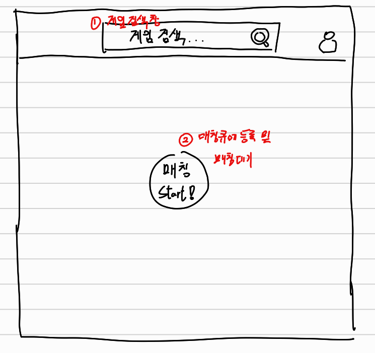

# 매칭 기획

  

## 1. 게임 검색 창

- Allqueue 서비스에서 제공하는 기능이 어떤 게임을 기준으로 제공될지를 선택할 수 있도록 게임을 검색 및 선택할 수 있는 기능
- 게임 선택이 완료되면 `web page 테마` 가 선택된 게임의 테마로 변경됨 (예 : 배너 이미지를 해당 게임 이미지, 기타 버튼 색상 등이 게임에 어울리는 컬러로 변경됨)

## 2. 매칭 큐에 등록 및 매칭 대기

- 게임이 선택되었다면 `매칭 strat! 버튼` 이 활성화 됩니다.
- `매칭 start 버튼` 클릭 시 현재 선택된 게임과 일치하는 자신의 프로필 정보를 기반으로 `큐`에 등록됩니다.
    - 만약 해당 게임에 대하 프로필 정보가 없을 경우 `선택된 게임에 대한 프로필 정보가 없습니다, 프로필을 마저 작성하시겠습니까?` 라는 알림 멘트와 사용자의 선택 의사를 묻는 `모달` 이 노출 됩니다, `예` 선택시 `프로필 작성 페에지로 이동됩니다`